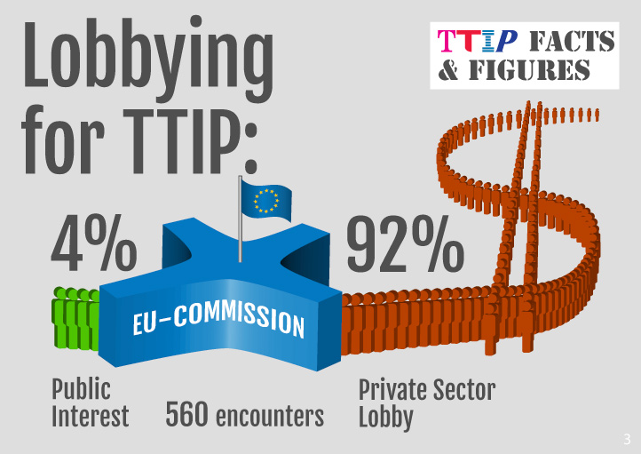

# Tratados de Libre Comercio, una amenaza para la democracia 

http://empoderarse.es  

---

## ¿Qué es un Tratado de Libre Comercio (TLC)?

> Un acuerdo entra dos o más partes para garantizar el cumplimiento de unas normas en el intercambio o la compra-venta de productos, bienes o servicios.

¿Es malo un Tratado de Libre Comercio? <!-- .element: class="fragment" -->

Los recientes acuerdos comerciales regionales (TTIP, CETA, TISA, etc) **van más allá del ámbito del comercio**. 

---

## La Organización Mundial del Comercio

Encargada de establecer las normas que rigen el comercio mundial.
Eliminación de aranceles y barreras aduaneras. 

Al igual que otras instituciones (BM, FMI, ONU, etc) está controlada por los gobiernos más poderosos y sus empresas transnacionales.

Fracaso de las negociaciones en los últimos años debido a la alianza de los más pequeños (vía campesina).

---

## Evolución de los TLC

----

### TLC activos o en negociación 

----

## Algunos TLC conocidos

- ALCA (América)
- NAFTA (EEUU, Canadá y Méjico)
- Acuerdo Transpacífico EEUU-Asia (sin China)
- CETA (UE-Canadá)
- TISA (Acuerdo de comercio de servicios entre 50 países)
- TTIP (EEUU-UE)

---

## Falta de transparencia y representatividad

- Negociaciones secretas 
- Desequilibrio en la representación del sector público y privado en las negociaciones.

---

## Denominaciones de Origen 

 

---

## ¿Cómo defendernos?

- Promoción del Mandato de Comercio Alternativo elaborado por más de 50 organizaciones europeas y con gran participación ciudadana para garantizar un comercio sostenible que no anteponga los intereses de las empresas a los derechos de las personas y del medio ambiente.

- Movilización social y convergencia de luchas

 

---

## ¡Gracias por su atención!

 
